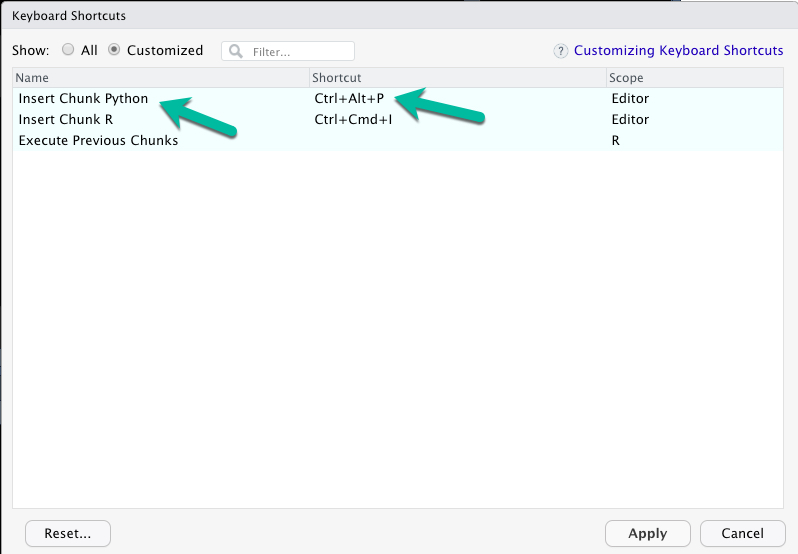
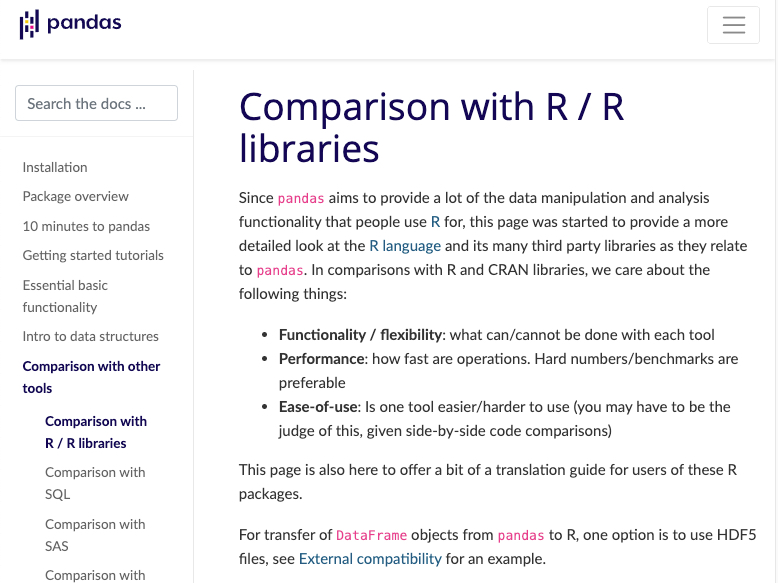
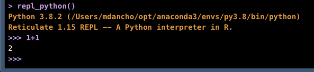

```{r setup, include=FALSE}
knitr::opts_chunk$set(
    echo = TRUE,
    message = FALSE,
    warning = FALSE
)
```

```{r}
library(tidyverse)
library(reticulate)
```

# Conda Installation

__Download__

- Anaconda Distribution - [Installation Instructions](https://docs.anaconda.com/anaconda/install/)

__List the Conda Environments Available__

```{r}
conda_list()
```

```{r}
use_condaenv("py3.8", required = TRUE)
```


```{r}
py_config()
```


# Python Tests

## Is Python working???

```{python}
# Is python working???
1 + 1
```


## Numpy & Pandas

```{python}
import numpy as np
import pandas as pd
```

```{python}
np.arange(1, 10)
```


```{python}
# Make a sequence in a data frame using dict format
df = pd.DataFrame(data = {"sequence":np.arange(1,20,.01)})

# Use assign (mutate) equivalent to calculate the np.sin() of the series
df = df.assign(value=np.sin(df["sequence"]))

df
```

## Matplotlib???

```{python, results="hide"}
help(df.plot)
```


```{python}
import matplotlib as plt

df.plot(x="sequence", y = "value", title = "Matplotlib")
```

## Scikit Learn???

- Note I had to downgrade to `scipy version 1.4.0` to run `scikit-learn`. In Terminal: `conda install -c conda-forge scipy=1.4.0`.


```{python}
from sklearn.ensemble import RandomForestClassifier

clf = RandomForestClassifier(random_state=0)

X = [[ 1,  2,  3],  # 2 samples, 3 features
     [11, 12, 13]]

y = [0, 1]  # classes of each sample

clf.fit(X, y)
```


```{python}
clf.predict(X)  # predict classes of the training data
```

# Lab 33 - Can you Run Affinity Progagation???

```{python}
from sklearn.cluster import AffinityPropagation
from sklearn import metrics
from sklearn.datasets import make_blobs

# #############################################################################
# Generate sample data
centers = [[1, 1], [-1, -1], [1, -1]]
X, labels_true = make_blobs(n_samples=300, centers=centers, cluster_std=0.5,
                            random_state=0)
```

```{python}
labels_true
```


```{python}
# Compute Affinity Propagation
af = AffinityPropagation(preference=-50).fit(X)
cluster_centers_indices = af.cluster_centers_indices_
labels = af.labels_

n_clusters_ = len(cluster_centers_indices)

print('Estimated number of clusters: %d' % n_clusters_)
print("Homogeneity: %0.3f" % metrics.homogeneity_score(labels_true, labels))
print("Completeness: %0.3f" % metrics.completeness_score(labels_true, labels))
print("V-measure: %0.3f" % metrics.v_measure_score(labels_true, labels))
print("Adjusted Rand Index: %0.3f"
      % metrics.adjusted_rand_score(labels_true, labels))
print("Adjusted Mutual Information: %0.3f"
      % metrics.adjusted_mutual_info_score(labels_true, labels))
print("Silhouette Coefficient: %0.3f"
      % metrics.silhouette_score(X, labels, metric='sqeuclidean'))
```

```{python}
# Plot result
import matplotlib.pyplot as plt
from itertools import cycle

plt.close('all')
plt.figure(1)
plt.clf()

colors = cycle('bgrcmykbgrcmykbgrcmykbgrcmyk')
for k, col in zip(range(n_clusters_), colors):
    class_members = labels == k
    cluster_center = X[cluster_centers_indices[k]]
    plt.plot(X[class_members, 0], X[class_members, 1], col + '.')
    plt.plot(cluster_center[0], cluster_center[1], 'o', markerfacecolor=col,
             markeredgecolor='k', markersize=14)
    for x in X[class_members]:
        plt.plot([cluster_center[0], x[0]], [cluster_center[1], x[1]], col)

plt.title('Estimated number of clusters: %d' % n_clusters_)
plt.show()
```


# Pro Tips

### Pro-Tip #1

- Setup Keyboard shortcut for Python Code Chunks!
- Super productivity booster for Python Development in Rmarkdown
- My preference: Ctrl + Alt + P


```{r, echo=FALSE}

```

## Pro-Tip #2

- Head to the [Comparison with R website](https://pandas.pydata.org/docs/getting_started/comparison/comparison_with_r.html) for conversion between R and Python

```{r, echo=F}

```


### Pro-Tip #3

- In R Console, you can run python interactively using `repl_python()`. You will see `>>>` indicating you are in Python Mode.
- Make sure the correct Python / Conda Environment is selected. 
- To escape Python in the console, just hit `escape`. 

```{r, echo=F}

```

### Pro-Tip #4

Conda Terminal Tips / Commands

- Run `conda list` to list the available conda environments
- Run `conda activate <env_name>` to activate a conda environment
- Run `conda update --all` to update all `python` packages in a conda environment. 
- Run `conda install <package_name>` to install a new package

